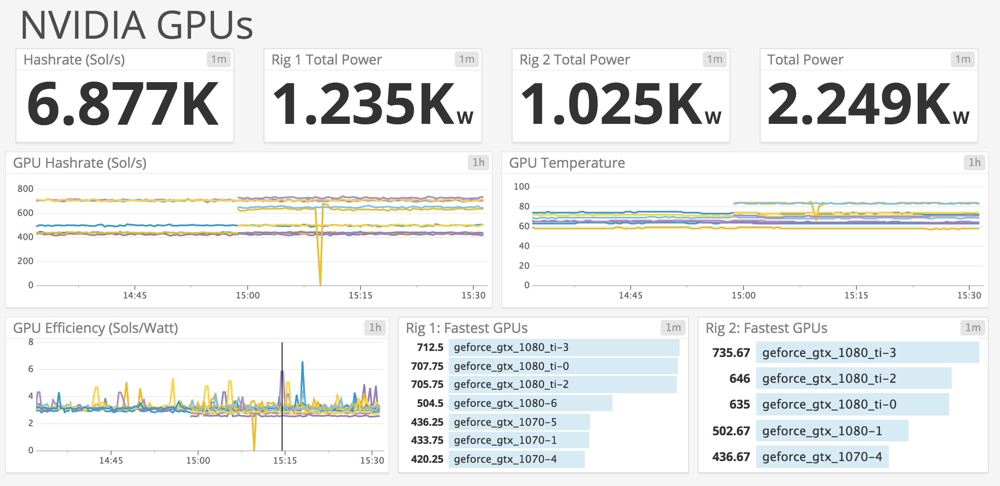

# ewbf-statsd
Statsd aggregator for the EWBF miner



If you need a miner, check out [djenriquez/ewbf-cuda-miner](https://github.com/djenriquez/ewbf-cuda-miner).

A Datadog account is required for this, but you can sign up for a free account which give you 5 hosts. Sign up here: https://www.datadoghq.com/

# Run:
Configure your EWBF miner to listen on port `PORT` by passing in the flag `--api 127.0.0.1:${PORT}`. Example:
```
HOST=127.0.0.1
PORT=5000
./miner --server equihash.usa.nicehash.com --port 3357 --user 33DyXVuy3R5jfLZRRpEQcXXAJ1Xz5rkGxE --pass x --eexit --api ${HOST}:${PORT}
```

Then run the docker run command to start the container.
```
DATADOG_API_KEY=<YOUR DATADOG API KEY>
DATADOG_APP_KEY=<YOUR DATADOG APP KEY>
docker run -d \
--restart always \
-e API_KEY=${DATADOG_API_KEY} \
-e APP_KEY=${DATADOG_APP_KEY} \
-e HOST=${HOST} \
-e PORT=${PORT} \
-e POLLSEC=15 \
--name statsd \
--net host \
djenriquez/ewbf-statsd:latest
```

## Donations
- BTC - 33DyXVuy3R5jfLZRRpEQcXXAJ1Xz5rkGxE
- LTC - MUaov1JidbnpfeuQiSR3mtJhN3CN8Wj5g9
- ETH - 0xCBBC579Ac1Bc4868823fbBb2D8dDaFF93D619ceD
- DASH - Xy4cgJVAiHsrbeBB53NeQWk2iXKoWjBvJp
- ZEC - t1gYs8Zn2ZCFZWKZsTmZWd5bgXa9eD8M87K
- ZCL - t1JthRczZHUrYW4ayU8PjWA3RcRhZs1SnDv
- BCH - LOL